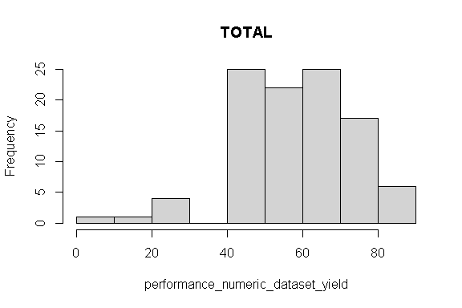
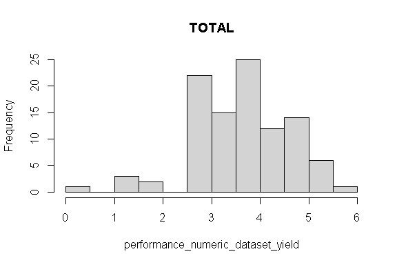
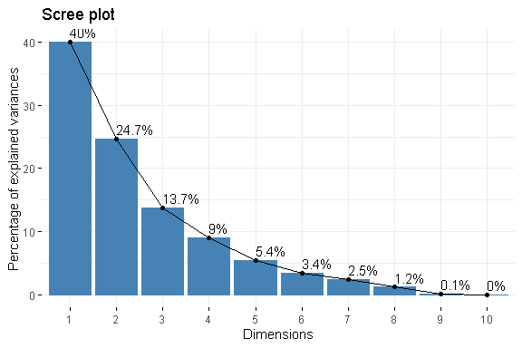
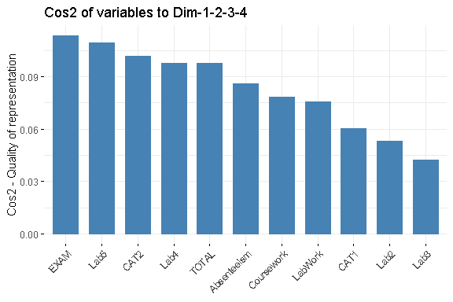
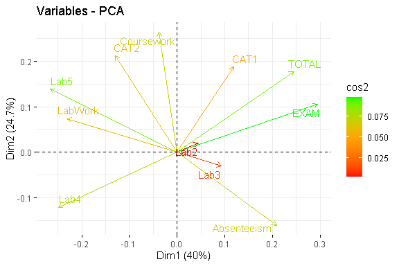

Business Intelligence Project
================
<Specify your name here>
<Specify the date when you submitted the lab>

- [Student Details](#student-details)
- [Setup Chunk](#setup-chunk)
- [Understanding the Dataset (Exploratory Data Analysis
  (EDA))](#understanding-the-dataset-exploratory-data-analysis-eda)
  - [Loading the Dataset](#loading-the-dataset)
    - [Source:](#source)
    - [Reference:](#reference)
  - [Subset](#subset)
- [Scale Data Transform](#scale-data-transform)
  - [BEFORE](#before)
  - [AFTER](#after)
- [Center Data Transform](#center-data-transform)
- [Standardize Data Transform](#standardize-data-transform)
  - [BEFORE](#before-1)
  - [AFTER](#after-1)
- [Normalize Data Transform](#normalize-data-transform)
- [Box-Cox Power Transform](#box-cox-power-transform)
  - [BEFORE](#before-2)
  - [AFTER](#after-2)
- [Yeo-Johnson Power Transform on the Crop
  Dataset](#yeo-johnson-power-transform-on-the-crop-dataset)
  - [BEFORE](#before-3)
- [Principal Component Analysis (PCA) Linear Algebra
  Transform](#principal-component-analysis-pca-linear-algebra-transform)
  - [PCA Linear Algebra Transform for Dimensionality
    Reduction](#pca-linear-algebra-transform-for-dimensionality-reduction)
  - [PCA Linear Algebra Transform for Feature
    Extraction](#pca-linear-algebra-transform-for-feature-extraction)
    - [Scree Plot](#scree-plot)
    - [Loading Values](#loading-values)
    - [Biplot and Cos2 Combined Plot](#biplot-and-cos2-combined-plot)
- [Independent Component Analysis (ICA) Linear Algebra
  Transform](#independent-component-analysis-ica-linear-algebra-transform)
  - [ICA Linear Algebra Transform for Dimensionality
    Reduction](#ica-linear-algebra-transform-for-dimensionality-reduction)

# Student Details

|                                              |                             |
|----------------------------------------------|-----------------------------|
| **Student ID Number**                        | 119630,135844,131038,104135 |
| **Student Name**                             | Beasts                      |
| **BBIT 4.2 Group**                           | A&B&C                       |
| **BI Project Group Name/ID (if applicable)** | Beasts                      |

# Setup Chunk

**Note:** the following KnitR options have been set as the global
defaults: <BR>
`knitr::opts_chunk$set(echo = TRUE, warning = FALSE, eval = TRUE, collapse = FALSE, tidy = TRUE)`.

More KnitR options are documented here
<https://bookdown.org/yihui/rmarkdown-cookbook/chunk-options.html> and
here <https://yihui.org/knitr/options/>.

# Understanding the Dataset (Exploratory Data Analysis (EDA))

## Loading the Dataset

### Source:

The dataset that was used can be downloaded here: *\<provide a link\>*

### Reference:

*\<Cite the dataset here using APA\>  
Refer to the APA 7th edition manual for rules on how to cite datasets:
<https://apastyle.apa.org/style-grammar-guidelines/references/examples/data-set-references>*

``` r
library(readr)
student_performance_dataset <-
  read_csv("data/20230412-20230719-BI1-BBIT4-1-StudentPerformanceDataset.CSV",
           col_types =
             cols(
               class_group = col_factor(levels = c("A", "B", "C")),
               gender = col_factor(levels = c("1", "0")),
               YOB = col_date(format = "%Y"),
               regret_choosing_bi = col_factor(levels = c("1", "0")),
               drop_bi_now = col_factor(levels = c("1", "0")),
               motivator = col_factor(levels = c("1", "0")),
               read_content_before_lecture =
                 col_factor(levels = c("1", "2", "3", "4", "5")),
               anticipate_test_questions =
                 col_factor(levels = c("1", "2", "3", "4", "5")),
               answer_rhetorical_questions =
                 col_factor(levels = c("1", "2", "3", "4", "5")),
               find_terms_I_do_not_know =
                 col_factor(levels = c("1", "2", "3", "4", "5")),
               copy_new_terms_in_reading_notebook =
                 col_factor(levels = c("1", "2", "3", "4", "5")),
               take_quizzes_and_use_results =
                 col_factor(levels = c("1", "2", "3", "4", "5")),
               reorganise_course_outline =
                 col_factor(levels = c("1", "2", "3", "4", "5")),
               write_down_important_points =
                 col_factor(levels = c("1", "2", "3", "4", "5")),
               space_out_revision =
                 col_factor(levels = c("1", "2", "3", "4", "5")),
               studying_in_study_group =
                 col_factor(levels = c("1", "2", "3", "4", "5")),
               schedule_appointments =
                 col_factor(levels = c("1", "2", "3", "4", "5")),
               goal_oriented = col_factor(levels = c("1", "0")),
               spaced_repetition =
                 col_factor(levels = c("1", "2", "3", "4")),
               testing_and_active_recall =
                 col_factor(levels = c("1", "2", "3", "4")),
               interleaving = col_factor(levels = c("1", "2", "3", "4")),
               categorizing = col_factor(levels = c("1", "2", "3", "4")),
               retrospective_timetable =
                 col_factor(levels = c("1", "2", "3", "4")),
               cornell_notes = col_factor(levels = c("1", "2", "3", "4")),
               sq3r = col_factor(levels = c("1", "2", "3", "4")),
               commute = col_factor(levels = c("1", "2", "3", "4")),
               study_time = col_factor(levels = c("1", "2", "3", "4")),
               repeats_since_Y1 = col_integer(),
               paid_tuition = col_factor(levels = c("0", "1")),
               free_tuition = col_factor(levels = c("0", "1")),
               extra_curricular = col_factor(levels = c("0", "1")),
               sports_extra_curricular = col_factor(levels = c("0", "1")),
               exercise_per_week = col_factor(levels = c("0", "1", "2", "3")),
               meditate = col_factor(levels = c("0", "1", "2", "3")),
               pray = col_factor(levels = c("0", "1", "2", "3")),
               internet = col_factor(levels = c("0", "1")),
               laptop = col_factor(levels = c("0", "1")),
               family_relationships =
                 col_factor(levels = c("1", "2", "3", "4", "5")),
               friendships = col_factor(levels = c("1", "2", "3", "4", "5")),
               romantic_relationships =
                 col_factor(levels = c("0", "1", "2", "3", "4")),
               spiritual_wellnes =
                 col_factor(levels = c("1", "2", "3", "4", "5")),
               financial_wellness =
                 col_factor(levels = c("1", "2", "3", "4", "5")),
               health = col_factor(levels = c("1", "2", "3", "4", "5")),
               day_out = col_factor(levels = c("0", "1", "2", "3")),
               night_out = col_factor(levels = c("0", "1", "2", "3")),
               alcohol_or_narcotics =
                 col_factor(levels = c("0", "1", "2", "3")),
               mentor = col_factor(levels = c("0", "1")),
               mentor_meetings = col_factor(levels = c("0", "1", "2", "3")),
               `Attendance Waiver Granted: 1 = Yes, 0 = No` =
                 col_factor(levels = c("0", "1")),
               GRADE = col_factor(levels = c("A", "B", "C", "D", "E"))),
           locale = locale())

#View(student_performance_dataset)
```

## Subset

``` r
library(dplyr)
```

    ## 
    ## Attaching package: 'dplyr'

    ## The following objects are masked from 'package:stats':
    ## 
    ##     filter, lag

    ## The following objects are masked from 'package:base':
    ## 
    ##     intersect, setdiff, setequal, union

``` r
# Create a subset with only the numeric columns,the non-numeric columns have been removed.
performance_numeric_dataset <- student_performance_dataset[sapply(student_performance_dataset, is.numeric)]

#  keep the first 11 numeric columns
performance_numeric_dataset <- performance_numeric_dataset[, 39:49]

# renamed the columns
performance_numeric_dataset <- performance_numeric_dataset %>% 
  rename(Lab2 = `Lab 2 - 2.e. -  (Linear Regression using Gradient Descent) x/5`, Lab3 = `Lab 3 - 2.g. - (Logistic Regression using Gradient Descent) x/5`, Lab4 = `Lab 4-2.h.- (Linear Discriminant Analysis) x/5`, Lab5 = `Lab 5 - Chart JS Dashboard Setup x/5`, LabWork = `Lab Work (7%) x/25 x 100`, CAT1 = `CAT 1 (8%): x/38 x 100`, CAT2 = `CAT 2 (8%): x/100 x 100`, Absenteeism = `Absenteeism Percentage`, Coursework = `Coursework TOTAL: x/40 (40%)`, EXAM = `EXAM: x/60 (60%)`, TOTAL = `TOTAL = Coursework TOTAL + EXAM (100%)`)
```

# Scale Data Transform

## BEFORE

``` r
library(caret)
```

    ## Loading required package: ggplot2

    ## Loading required package: lattice

``` r
summary(performance_numeric_dataset)
```

    ##       Lab2            Lab3           Lab4            Lab5      
    ##  Min.   :2.150   Min.   :2.85   Min.   :1.850   Min.   :0.000  
    ##  1st Qu.:3.150   1st Qu.:4.85   1st Qu.:4.100   1st Qu.:0.000  
    ##  Median :4.850   Median :4.85   Median :4.850   Median :5.000  
    ##  Mean   :4.166   Mean   :4.63   Mean   :4.425   Mean   :3.404  
    ##  3rd Qu.:5.000   3rd Qu.:4.85   3rd Qu.:5.000   3rd Qu.:5.000  
    ##  Max.   :5.000   Max.   :5.00   Max.   :5.000   Max.   :5.000  
    ##  NA's   :6       NA's   :9      NA's   :18                     
    ##     LabWork            CAT1            CAT2         Absenteeism   
    ##  Min.   : 17.80   Min.   :32.89   Min.   :  0.00   Min.   : 0.00  
    ##  1st Qu.: 70.80   1st Qu.:59.21   1st Qu.: 51.00   1st Qu.: 7.41  
    ##  Median : 80.00   Median :69.73   Median : 63.50   Median :14.81  
    ##  Mean   : 79.72   Mean   :69.39   Mean   : 62.13   Mean   :15.42  
    ##  3rd Qu.: 97.20   3rd Qu.:82.89   3rd Qu.: 81.75   3rd Qu.:22.22  
    ##  Max.   :100.00   Max.   :97.36   Max.   :100.00   Max.   :51.85  
    ##                   NA's   :4       NA's   :31                      
    ##    Coursework         EXAM           TOTAL      
    ##  Min.   : 7.47   Min.   : 5.00   Min.   : 7.47  
    ##  1st Qu.:20.44   1st Qu.:26.00   1st Qu.:45.54  
    ##  Median :24.58   Median :34.00   Median :58.69  
    ##  Mean   :24.53   Mean   :33.94   Mean   :57.12  
    ##  3rd Qu.:29.31   3rd Qu.:42.00   3rd Qu.:68.83  
    ##  Max.   :35.08   Max.   :56.00   Max.   :87.72  
    ##                  NA's   :4

``` r
performance_numeric_dataset_yield <- as.numeric(unlist(performance_numeric_dataset[, 11]))
hist(performance_numeric_dataset_yield, main = names(performance_numeric_dataset)[11])
```

<!-- -->

``` r
model_of_the_transform <- preProcess(performance_numeric_dataset, method = c("scale"))
print(model_of_the_transform)
```

    ## Created from 59 samples and 11 variables
    ## 
    ## Pre-processing:
    ##   - ignored (0)
    ##   - scaled (11)

``` r
performance_data_scale_transform <- predict(model_of_the_transform, performance_numeric_dataset)
```

## AFTER

``` r
summary(performance_data_scale_transform)
```

    ##       Lab2            Lab3            Lab4            Lab5      
    ##  Min.   :2.078   Min.   :4.450   Min.   :2.054   Min.   :0.000  
    ##  1st Qu.:3.044   1st Qu.:7.572   1st Qu.:4.552   1st Qu.:0.000  
    ##  Median :4.687   Median :7.572   Median :5.385   Median :2.143  
    ##  Mean   :4.026   Mean   :7.229   Mean   :4.913   Mean   :1.459  
    ##  3rd Qu.:4.832   3rd Qu.:7.572   3rd Qu.:5.551   3rd Qu.:2.143  
    ##  Max.   :4.832   Max.   :7.806   Max.   :5.551   Max.   :2.143  
    ##  NA's   :6       NA's   :9       NA's   :18                     
    ##     LabWork            CAT1            CAT2        Absenteeism    
    ##  Min.   :0.9221   Min.   :2.175   Min.   :0.000   Min.   :0.0000  
    ##  1st Qu.:3.6678   1st Qu.:3.915   1st Qu.:2.067   1st Qu.:0.8153  
    ##  Median :4.1444   Median :4.610   Median :2.574   Median :1.6295  
    ##  Mean   :4.1297   Mean   :4.588   Mean   :2.518   Mean   :1.6961  
    ##  3rd Qu.:5.0355   3rd Qu.:5.480   3rd Qu.:3.314   3rd Qu.:2.4448  
    ##  Max.   :5.1805   Max.   :6.437   Max.   :4.053   Max.   :5.7049  
    ##                   NA's   :4       NA's   :31                      
    ##    Coursework         EXAM            TOTAL      
    ##  Min.   :1.200   Min.   :0.4441   Min.   :0.475  
    ##  1st Qu.:3.284   1st Qu.:2.3094   1st Qu.:2.896  
    ##  Median :3.949   Median :3.0200   Median :3.732  
    ##  Mean   :3.941   Mean   :3.0145   Mean   :3.632  
    ##  3rd Qu.:4.709   3rd Qu.:3.7306   3rd Qu.:4.377  
    ##  Max.   :5.636   Max.   :4.9742   Max.   :5.578  
    ##                  NA's   :4

``` r
performance_numeric_dataset_yield <- as.numeric(unlist(performance_data_scale_transform[, 11]))
hist(performance_numeric_dataset_yield, main = names(performance_data_scale_transform)[11])
```

<!-- -->

# Center Data Transform

``` r
summary(performance_numeric_dataset)
```

    ##       Lab2            Lab3           Lab4            Lab5      
    ##  Min.   :2.150   Min.   :2.85   Min.   :1.850   Min.   :0.000  
    ##  1st Qu.:3.150   1st Qu.:4.85   1st Qu.:4.100   1st Qu.:0.000  
    ##  Median :4.850   Median :4.85   Median :4.850   Median :5.000  
    ##  Mean   :4.166   Mean   :4.63   Mean   :4.425   Mean   :3.404  
    ##  3rd Qu.:5.000   3rd Qu.:4.85   3rd Qu.:5.000   3rd Qu.:5.000  
    ##  Max.   :5.000   Max.   :5.00   Max.   :5.000   Max.   :5.000  
    ##  NA's   :6       NA's   :9      NA's   :18                     
    ##     LabWork            CAT1            CAT2         Absenteeism   
    ##  Min.   : 17.80   Min.   :32.89   Min.   :  0.00   Min.   : 0.00  
    ##  1st Qu.: 70.80   1st Qu.:59.21   1st Qu.: 51.00   1st Qu.: 7.41  
    ##  Median : 80.00   Median :69.73   Median : 63.50   Median :14.81  
    ##  Mean   : 79.72   Mean   :69.39   Mean   : 62.13   Mean   :15.42  
    ##  3rd Qu.: 97.20   3rd Qu.:82.89   3rd Qu.: 81.75   3rd Qu.:22.22  
    ##  Max.   :100.00   Max.   :97.36   Max.   :100.00   Max.   :51.85  
    ##                   NA's   :4       NA's   :31                      
    ##    Coursework         EXAM           TOTAL      
    ##  Min.   : 7.47   Min.   : 5.00   Min.   : 7.47  
    ##  1st Qu.:20.44   1st Qu.:26.00   1st Qu.:45.54  
    ##  Median :24.58   Median :34.00   Median :58.69  
    ##  Mean   :24.53   Mean   :33.94   Mean   :57.12  
    ##  3rd Qu.:29.31   3rd Qu.:42.00   3rd Qu.:68.83  
    ##  Max.   :35.08   Max.   :56.00   Max.   :87.72  
    ##                  NA's   :4

``` r
model_of_the_transform <- preProcess(performance_numeric_dataset, method = c("center"))
print(model_of_the_transform)
```

    ## Created from 59 samples and 11 variables
    ## 
    ## Pre-processing:
    ##   - centered (11)
    ##   - ignored (0)

``` r
performance_data_center_transform <- predict(model_of_the_transform, performance_numeric_dataset)

summary(performance_data_center_transform)
```

    ##       Lab2              Lab3              Lab4              Lab5       
    ##  Min.   :-2.0163   Min.   :-1.7802   Min.   :-2.5747   Min.   :-3.404  
    ##  1st Qu.:-1.0163   1st Qu.: 0.2198   1st Qu.:-0.3247   1st Qu.:-3.404  
    ##  Median : 0.6837   Median : 0.2198   Median : 0.4253   Median : 1.596  
    ##  Mean   : 0.0000   Mean   : 0.0000   Mean   : 0.0000   Mean   : 0.000  
    ##  3rd Qu.: 0.8337   3rd Qu.: 0.2198   3rd Qu.: 0.5753   3rd Qu.: 1.596  
    ##  Max.   : 0.8337   Max.   : 0.3698   Max.   : 0.5753   Max.   : 1.596  
    ##  NA's   :6         NA's   :9         NA's   :18                        
    ##     LabWork             CAT1               CAT2          Absenteeism      
    ##  Min.   :-61.916   Min.   :-36.5033   Min.   :-62.129   Min.   :-15.4155  
    ##  1st Qu.: -8.916   1st Qu.:-10.1833   1st Qu.:-11.129   1st Qu.: -8.0055  
    ##  Median :  0.284   Median :  0.3367   Median :  1.371   Median : -0.6055  
    ##  Mean   :  0.000   Mean   :  0.0000   Mean   :  0.000   Mean   :  0.0000  
    ##  3rd Qu.: 17.484   3rd Qu.: 13.4967   3rd Qu.: 19.621   3rd Qu.:  6.8045  
    ##  Max.   : 20.284   Max.   : 27.9667   Max.   : 37.871   Max.   : 36.4345  
    ##                    NA's   :4          NA's   :31                          
    ##    Coursework             EXAM               TOTAL       
    ##  Min.   :-17.05604   Min.   :-28.93814   Min.   :-49.65  
    ##  1st Qu.: -4.08604   1st Qu.: -7.93814   1st Qu.:-11.58  
    ##  Median :  0.05396   Median :  0.06186   Median :  1.57  
    ##  Mean   :  0.00000   Mean   :  0.00000   Mean   :  0.00  
    ##  3rd Qu.:  4.78396   3rd Qu.:  8.06186   3rd Qu.: 11.71  
    ##  Max.   : 10.55396   Max.   : 22.06186   Max.   : 30.60  
    ##                      NA's   :4

# Standardize Data Transform

## BEFORE

``` r
library(caret)
summary(performance_numeric_dataset)
```

    ##       Lab2            Lab3           Lab4            Lab5      
    ##  Min.   :2.150   Min.   :2.85   Min.   :1.850   Min.   :0.000  
    ##  1st Qu.:3.150   1st Qu.:4.85   1st Qu.:4.100   1st Qu.:0.000  
    ##  Median :4.850   Median :4.85   Median :4.850   Median :5.000  
    ##  Mean   :4.166   Mean   :4.63   Mean   :4.425   Mean   :3.404  
    ##  3rd Qu.:5.000   3rd Qu.:4.85   3rd Qu.:5.000   3rd Qu.:5.000  
    ##  Max.   :5.000   Max.   :5.00   Max.   :5.000   Max.   :5.000  
    ##  NA's   :6       NA's   :9      NA's   :18                     
    ##     LabWork            CAT1            CAT2         Absenteeism   
    ##  Min.   : 17.80   Min.   :32.89   Min.   :  0.00   Min.   : 0.00  
    ##  1st Qu.: 70.80   1st Qu.:59.21   1st Qu.: 51.00   1st Qu.: 7.41  
    ##  Median : 80.00   Median :69.73   Median : 63.50   Median :14.81  
    ##  Mean   : 79.72   Mean   :69.39   Mean   : 62.13   Mean   :15.42  
    ##  3rd Qu.: 97.20   3rd Qu.:82.89   3rd Qu.: 81.75   3rd Qu.:22.22  
    ##  Max.   :100.00   Max.   :97.36   Max.   :100.00   Max.   :51.85  
    ##                   NA's   :4       NA's   :31                      
    ##    Coursework         EXAM           TOTAL      
    ##  Min.   : 7.47   Min.   : 5.00   Min.   : 7.47  
    ##  1st Qu.:20.44   1st Qu.:26.00   1st Qu.:45.54  
    ##  Median :24.58   Median :34.00   Median :58.69  
    ##  Mean   :24.53   Mean   :33.94   Mean   :57.12  
    ##  3rd Qu.:29.31   3rd Qu.:42.00   3rd Qu.:68.83  
    ##  Max.   :35.08   Max.   :56.00   Max.   :87.72  
    ##                  NA's   :4

``` r
sapply(performance_numeric_dataset[, 11], sd)
```

    ##    TOTAL 
    ## 15.72533

``` r
model_of_the_transform <- preProcess(performance_numeric_dataset,
                                     method = c("scale", "center"))
print(model_of_the_transform)
```

    ## Created from 59 samples and 11 variables
    ## 
    ## Pre-processing:
    ##   - centered (11)
    ##   - ignored (0)
    ##   - scaled (11)

``` r
performance_data_standardize_transform <- predict(model_of_the_transform, performance_numeric_dataset) # nolint
```

## AFTER

``` r
summary(performance_data_standardize_transform)
```

    ##       Lab2              Lab3              Lab4              Lab5        
    ##  Min.   :-1.9485   Min.   :-2.7794   Min.   :-2.8586   Min.   :-1.4592  
    ##  1st Qu.:-0.9821   1st Qu.: 0.3431   1st Qu.:-0.3605   1st Qu.:-1.4592  
    ##  Median : 0.6607   Median : 0.3431   Median : 0.4722   Median : 0.6842  
    ##  Mean   : 0.0000   Mean   : 0.0000   Mean   : 0.0000   Mean   : 0.0000  
    ##  3rd Qu.: 0.8056   3rd Qu.: 0.3431   3rd Qu.: 0.6387   3rd Qu.: 0.6842  
    ##  Max.   : 0.8056   Max.   : 0.5773   Max.   : 0.6387   Max.   : 0.6842  
    ##  NA's   :6         NA's   :9         NA's   :18                         
    ##     LabWork              CAT1               CAT2           Absenteeism      
    ##  Min.   :-3.20757   Min.   :-2.41349   Min.   :-2.51821   Min.   :-1.69613  
    ##  1st Qu.:-0.46190   1st Qu.:-0.67329   1st Qu.:-0.45107   1st Qu.:-0.88083  
    ##  Median : 0.01471   Median : 0.02226   Median : 0.05559   Median :-0.06663  
    ##  Mean   : 0.00000   Mean   : 0.00000   Mean   : 0.00000   Mean   : 0.00000  
    ##  3rd Qu.: 0.90576   3rd Qu.: 0.89236   3rd Qu.: 0.79530   3rd Qu.: 0.74867  
    ##  Max.   : 1.05081   Max.   : 1.84908   Max.   : 1.53501   Max.   : 4.00877  
    ##                     NA's   :4          NA's   :31                           
    ##    Coursework            EXAM               TOTAL         
    ##  Min.   :-2.74036   Min.   :-2.570415   Min.   :-3.15733  
    ##  1st Qu.:-0.65650   1st Qu.:-0.705101   1st Qu.:-0.73640  
    ##  Median : 0.00867   Median : 0.005494   Median : 0.09983  
    ##  Mean   : 0.00000   Mean   : 0.000000   Mean   : 0.00000  
    ##  3rd Qu.: 0.76863   3rd Qu.: 0.716090   3rd Qu.: 0.74465  
    ##  Max.   : 1.69569   Max.   : 1.959633   Max.   : 1.94590  
    ##                     NA's   :4

``` r
sapply(performance_data_standardize_transform[, 11], sd)
```

    ## TOTAL 
    ##     1

# Normalize Data Transform

``` r
summary(performance_numeric_dataset)
```

    ##       Lab2            Lab3           Lab4            Lab5      
    ##  Min.   :2.150   Min.   :2.85   Min.   :1.850   Min.   :0.000  
    ##  1st Qu.:3.150   1st Qu.:4.85   1st Qu.:4.100   1st Qu.:0.000  
    ##  Median :4.850   Median :4.85   Median :4.850   Median :5.000  
    ##  Mean   :4.166   Mean   :4.63   Mean   :4.425   Mean   :3.404  
    ##  3rd Qu.:5.000   3rd Qu.:4.85   3rd Qu.:5.000   3rd Qu.:5.000  
    ##  Max.   :5.000   Max.   :5.00   Max.   :5.000   Max.   :5.000  
    ##  NA's   :6       NA's   :9      NA's   :18                     
    ##     LabWork            CAT1            CAT2         Absenteeism   
    ##  Min.   : 17.80   Min.   :32.89   Min.   :  0.00   Min.   : 0.00  
    ##  1st Qu.: 70.80   1st Qu.:59.21   1st Qu.: 51.00   1st Qu.: 7.41  
    ##  Median : 80.00   Median :69.73   Median : 63.50   Median :14.81  
    ##  Mean   : 79.72   Mean   :69.39   Mean   : 62.13   Mean   :15.42  
    ##  3rd Qu.: 97.20   3rd Qu.:82.89   3rd Qu.: 81.75   3rd Qu.:22.22  
    ##  Max.   :100.00   Max.   :97.36   Max.   :100.00   Max.   :51.85  
    ##                   NA's   :4       NA's   :31                      
    ##    Coursework         EXAM           TOTAL      
    ##  Min.   : 7.47   Min.   : 5.00   Min.   : 7.47  
    ##  1st Qu.:20.44   1st Qu.:26.00   1st Qu.:45.54  
    ##  Median :24.58   Median :34.00   Median :58.69  
    ##  Mean   :24.53   Mean   :33.94   Mean   :57.12  
    ##  3rd Qu.:29.31   3rd Qu.:42.00   3rd Qu.:68.83  
    ##  Max.   :35.08   Max.   :56.00   Max.   :87.72  
    ##                  NA's   :4

``` r
model_of_the_transform <- preProcess(performance_numeric_dataset, method = c("range"))
print(model_of_the_transform)
```

    ## Created from 59 samples and 11 variables
    ## 
    ## Pre-processing:
    ##   - ignored (0)
    ##   - re-scaling to [0, 1] (11)

``` r
performance_data_normalize_transform <- predict(model_of_the_transform, performance_numeric_dataset)
summary(performance_data_normalize_transform)
```

    ##       Lab2             Lab3             Lab4             Lab5       
    ##  Min.   :0.0000   Min.   :0.0000   Min.   :0.0000   Min.   :0.0000  
    ##  1st Qu.:0.3509   1st Qu.:0.9302   1st Qu.:0.7143   1st Qu.:0.0000  
    ##  Median :0.9474   Median :0.9302   Median :0.9524   Median :1.0000  
    ##  Mean   :0.7075   Mean   :0.8280   Mean   :0.8174   Mean   :0.6808  
    ##  3rd Qu.:1.0000   3rd Qu.:0.9302   3rd Qu.:1.0000   3rd Qu.:1.0000  
    ##  Max.   :1.0000   Max.   :1.0000   Max.   :1.0000   Max.   :1.0000  
    ##  NA's   :6        NA's   :9        NA's   :18                       
    ##     LabWork            CAT1             CAT2         Absenteeism    
    ##  Min.   :0.0000   Min.   :0.0000   Min.   :0.0000   Min.   :0.0000  
    ##  1st Qu.:0.6448   1st Qu.:0.4083   1st Qu.:0.5100   1st Qu.:0.1429  
    ##  Median :0.7567   Median :0.5714   Median :0.6350   Median :0.2856  
    ##  Mean   :0.7532   Mean   :0.5662   Mean   :0.6213   Mean   :0.2973  
    ##  3rd Qu.:0.9659   3rd Qu.:0.7756   3rd Qu.:0.8175   3rd Qu.:0.4285  
    ##  Max.   :1.0000   Max.   :1.0000   Max.   :1.0000   Max.   :1.0000  
    ##                   NA's   :4        NA's   :31                       
    ##    Coursework          EXAM            TOTAL       
    ##  Min.   :0.0000   Min.   :0.0000   Min.   :0.0000  
    ##  1st Qu.:0.4698   1st Qu.:0.4118   1st Qu.:0.4744  
    ##  Median :0.6197   Median :0.5686   Median :0.6383  
    ##  Mean   :0.6177   Mean   :0.5674   Mean   :0.6187  
    ##  3rd Qu.:0.7910   3rd Qu.:0.7255   3rd Qu.:0.7646  
    ##  Max.   :1.0000   Max.   :1.0000   Max.   :1.0000  
    ##                   NA's   :4

# Box-Cox Power Transform

## BEFORE

``` r
library(e1071)
summary(performance_data_standardize_transform)
```

    ##       Lab2              Lab3              Lab4              Lab5        
    ##  Min.   :-1.9485   Min.   :-2.7794   Min.   :-2.8586   Min.   :-1.4592  
    ##  1st Qu.:-0.9821   1st Qu.: 0.3431   1st Qu.:-0.3605   1st Qu.:-1.4592  
    ##  Median : 0.6607   Median : 0.3431   Median : 0.4722   Median : 0.6842  
    ##  Mean   : 0.0000   Mean   : 0.0000   Mean   : 0.0000   Mean   : 0.0000  
    ##  3rd Qu.: 0.8056   3rd Qu.: 0.3431   3rd Qu.: 0.6387   3rd Qu.: 0.6842  
    ##  Max.   : 0.8056   Max.   : 0.5773   Max.   : 0.6387   Max.   : 0.6842  
    ##  NA's   :6         NA's   :9         NA's   :18                         
    ##     LabWork              CAT1               CAT2           Absenteeism      
    ##  Min.   :-3.20757   Min.   :-2.41349   Min.   :-2.51821   Min.   :-1.69613  
    ##  1st Qu.:-0.46190   1st Qu.:-0.67329   1st Qu.:-0.45107   1st Qu.:-0.88083  
    ##  Median : 0.01471   Median : 0.02226   Median : 0.05559   Median :-0.06663  
    ##  Mean   : 0.00000   Mean   : 0.00000   Mean   : 0.00000   Mean   : 0.00000  
    ##  3rd Qu.: 0.90576   3rd Qu.: 0.89236   3rd Qu.: 0.79530   3rd Qu.: 0.74867  
    ##  Max.   : 1.05081   Max.   : 1.84908   Max.   : 1.53501   Max.   : 4.00877  
    ##                     NA's   :4          NA's   :31                           
    ##    Coursework            EXAM               TOTAL         
    ##  Min.   :-2.74036   Min.   :-2.570415   Min.   :-3.15733  
    ##  1st Qu.:-0.65650   1st Qu.:-0.705101   1st Qu.:-0.73640  
    ##  Median : 0.00867   Median : 0.005494   Median : 0.09983  
    ##  Mean   : 0.00000   Mean   : 0.000000   Mean   : 0.00000  
    ##  3rd Qu.: 0.76863   3rd Qu.: 0.716090   3rd Qu.: 0.74465  
    ##  Max.   : 1.69569   Max.   : 1.959633   Max.   : 1.94590  
    ##                     NA's   :4

``` r
# Calculate the skewness before the Box-Cox transform
sapply(performance_data_standardize_transform[, 11],  skewness, type = 2)
```

    ##      TOTAL 
    ## -0.4713841

``` r
sapply(performance_data_standardize_transform[, 11], sd)
```

    ## TOTAL 
    ##     1

``` r
model_of_the_transform <- preProcess(performance_data_standardize_transform,
                                     method = c("BoxCox"))
print(model_of_the_transform)
```

    ## Created from 59 samples and 0 variables
    ## 
    ## Pre-processing:
    ##   - ignored (0)

``` r
performance_data_box_cox_transform <- predict(model_of_the_transform,
                                       performance_data_standardize_transform)
```

## AFTER

``` r
summary(performance_data_box_cox_transform)
```

    ##       Lab2              Lab3              Lab4              Lab5        
    ##  Min.   :-1.9485   Min.   :-2.7794   Min.   :-2.8586   Min.   :-1.4592  
    ##  1st Qu.:-0.9821   1st Qu.: 0.3431   1st Qu.:-0.3605   1st Qu.:-1.4592  
    ##  Median : 0.6607   Median : 0.3431   Median : 0.4722   Median : 0.6842  
    ##  Mean   : 0.0000   Mean   : 0.0000   Mean   : 0.0000   Mean   : 0.0000  
    ##  3rd Qu.: 0.8056   3rd Qu.: 0.3431   3rd Qu.: 0.6387   3rd Qu.: 0.6842  
    ##  Max.   : 0.8056   Max.   : 0.5773   Max.   : 0.6387   Max.   : 0.6842  
    ##  NA's   :6         NA's   :9         NA's   :18                         
    ##     LabWork              CAT1               CAT2           Absenteeism      
    ##  Min.   :-3.20757   Min.   :-2.41349   Min.   :-2.51821   Min.   :-1.69613  
    ##  1st Qu.:-0.46190   1st Qu.:-0.67329   1st Qu.:-0.45107   1st Qu.:-0.88083  
    ##  Median : 0.01471   Median : 0.02226   Median : 0.05559   Median :-0.06663  
    ##  Mean   : 0.00000   Mean   : 0.00000   Mean   : 0.00000   Mean   : 0.00000  
    ##  3rd Qu.: 0.90576   3rd Qu.: 0.89236   3rd Qu.: 0.79530   3rd Qu.: 0.74867  
    ##  Max.   : 1.05081   Max.   : 1.84908   Max.   : 1.53501   Max.   : 4.00877  
    ##                     NA's   :4          NA's   :31                           
    ##    Coursework            EXAM               TOTAL         
    ##  Min.   :-2.74036   Min.   :-2.570415   Min.   :-3.15733  
    ##  1st Qu.:-0.65650   1st Qu.:-0.705101   1st Qu.:-0.73640  
    ##  Median : 0.00867   Median : 0.005494   Median : 0.09983  
    ##  Mean   : 0.00000   Mean   : 0.000000   Mean   : 0.00000  
    ##  3rd Qu.: 0.76863   3rd Qu.: 0.716090   3rd Qu.: 0.74465  
    ##  Max.   : 1.69569   Max.   : 1.959633   Max.   : 1.94590  
    ##                     NA's   :4

``` r
sapply(performance_data_box_cox_transform[, 11],  skewness, type = 2)
```

    ##      TOTAL 
    ## -0.4713841

``` r
sapply(performance_data_box_cox_transform[, 11], sd)
```

    ## TOTAL 
    ##     1

``` r
# Calculate the skewness after the Box-Cox transform
sapply(performance_data_box_cox_transform[, 11],  skewness, type = 2)
```

    ##      TOTAL 
    ## -0.4713841

``` r
sapply(performance_data_box_cox_transform[, 11], sd)
```

    ## TOTAL 
    ##     1

# Yeo-Johnson Power Transform on the Crop Dataset

## BEFORE

``` r
summary(performance_data_standardize_transform)
```

    ##       Lab2              Lab3              Lab4              Lab5        
    ##  Min.   :-1.9485   Min.   :-2.7794   Min.   :-2.8586   Min.   :-1.4592  
    ##  1st Qu.:-0.9821   1st Qu.: 0.3431   1st Qu.:-0.3605   1st Qu.:-1.4592  
    ##  Median : 0.6607   Median : 0.3431   Median : 0.4722   Median : 0.6842  
    ##  Mean   : 0.0000   Mean   : 0.0000   Mean   : 0.0000   Mean   : 0.0000  
    ##  3rd Qu.: 0.8056   3rd Qu.: 0.3431   3rd Qu.: 0.6387   3rd Qu.: 0.6842  
    ##  Max.   : 0.8056   Max.   : 0.5773   Max.   : 0.6387   Max.   : 0.6842  
    ##  NA's   :6         NA's   :9         NA's   :18                         
    ##     LabWork              CAT1               CAT2           Absenteeism      
    ##  Min.   :-3.20757   Min.   :-2.41349   Min.   :-2.51821   Min.   :-1.69613  
    ##  1st Qu.:-0.46190   1st Qu.:-0.67329   1st Qu.:-0.45107   1st Qu.:-0.88083  
    ##  Median : 0.01471   Median : 0.02226   Median : 0.05559   Median :-0.06663  
    ##  Mean   : 0.00000   Mean   : 0.00000   Mean   : 0.00000   Mean   : 0.00000  
    ##  3rd Qu.: 0.90576   3rd Qu.: 0.89236   3rd Qu.: 0.79530   3rd Qu.: 0.74867  
    ##  Max.   : 1.05081   Max.   : 1.84908   Max.   : 1.53501   Max.   : 4.00877  
    ##                     NA's   :4          NA's   :31                           
    ##    Coursework            EXAM               TOTAL         
    ##  Min.   :-2.74036   Min.   :-2.570415   Min.   :-3.15733  
    ##  1st Qu.:-0.65650   1st Qu.:-0.705101   1st Qu.:-0.73640  
    ##  Median : 0.00867   Median : 0.005494   Median : 0.09983  
    ##  Mean   : 0.00000   Mean   : 0.000000   Mean   : 0.00000  
    ##  3rd Qu.: 0.76863   3rd Qu.: 0.716090   3rd Qu.: 0.74465  
    ##  Max.   : 1.69569   Max.   : 1.959633   Max.   : 1.94590  
    ##                     NA's   :4

``` r
# Calculate the skewness before the Yeo-Johnson transform
sapply(performance_data_standardize_transform[, 11],  skewness, type = 2)
```

    ##      TOTAL 
    ## -0.4713841

``` r
sapply(performance_data_standardize_transform[, 11], sd)
```

    ## TOTAL 
    ##     1

``` r
model_of_the_transform <- preProcess(performance_data_standardize_transform,
                                     method = c("YeoJohnson"))
print(model_of_the_transform)
```

    ## Created from 59 samples and 9 variables
    ## 
    ## Pre-processing:
    ##   - ignored (0)
    ##   - Yeo-Johnson transformation (9)
    ## 
    ## Lambda estimates for Yeo-Johnson transformation:
    ## 2.16, 2.78, 1.77, 1.17, 1.36, 0.71, 1.27, 1.09, 1.24

``` r
performance_data_yeo_johnson_transform <- predict(model_of_the_transform, # nolint
                                           performance_data_standardize_transform)
```

# Principal Component Analysis (PCA) Linear Algebra Transform

## PCA Linear Algebra Transform for Dimensionality Reduction

``` r
summary(performance_numeric_dataset)
```

    ##       Lab2            Lab3           Lab4            Lab5      
    ##  Min.   :2.150   Min.   :2.85   Min.   :1.850   Min.   :0.000  
    ##  1st Qu.:3.150   1st Qu.:4.85   1st Qu.:4.100   1st Qu.:0.000  
    ##  Median :4.850   Median :4.85   Median :4.850   Median :5.000  
    ##  Mean   :4.166   Mean   :4.63   Mean   :4.425   Mean   :3.404  
    ##  3rd Qu.:5.000   3rd Qu.:4.85   3rd Qu.:5.000   3rd Qu.:5.000  
    ##  Max.   :5.000   Max.   :5.00   Max.   :5.000   Max.   :5.000  
    ##  NA's   :6       NA's   :9      NA's   :18                     
    ##     LabWork            CAT1            CAT2         Absenteeism   
    ##  Min.   : 17.80   Min.   :32.89   Min.   :  0.00   Min.   : 0.00  
    ##  1st Qu.: 70.80   1st Qu.:59.21   1st Qu.: 51.00   1st Qu.: 7.41  
    ##  Median : 80.00   Median :69.73   Median : 63.50   Median :14.81  
    ##  Mean   : 79.72   Mean   :69.39   Mean   : 62.13   Mean   :15.42  
    ##  3rd Qu.: 97.20   3rd Qu.:82.89   3rd Qu.: 81.75   3rd Qu.:22.22  
    ##  Max.   :100.00   Max.   :97.36   Max.   :100.00   Max.   :51.85  
    ##                   NA's   :4       NA's   :31                      
    ##    Coursework         EXAM           TOTAL      
    ##  Min.   : 7.47   Min.   : 5.00   Min.   : 7.47  
    ##  1st Qu.:20.44   1st Qu.:26.00   1st Qu.:45.54  
    ##  Median :24.58   Median :34.00   Median :58.69  
    ##  Mean   :24.53   Mean   :33.94   Mean   :57.12  
    ##  3rd Qu.:29.31   3rd Qu.:42.00   3rd Qu.:68.83  
    ##  Max.   :35.08   Max.   :56.00   Max.   :87.72  
    ##                  NA's   :4

``` r
model_of_the_transform <- preProcess(performance_numeric_dataset, method =
                                       c("scale", "center", "pca"))

print(model_of_the_transform)
```

    ## Created from 59 samples and 11 variables
    ## 
    ## Pre-processing:
    ##   - centered (11)
    ##   - ignored (0)
    ##   - principal component signal extraction (11)
    ##   - scaled (11)
    ## 
    ## PCA needed 8 components to capture 95 percent of the variance

``` r
performance_pca_dr <- predict(model_of_the_transform, performance_numeric_dataset)

summary(performance_pca_dr)
```

    ##       PC1                PC2               PC3                PC4          
    ##  Min.   :-3.51829   Min.   :-3.1533   Min.   :-2.68907   Min.   :-1.97106  
    ##  1st Qu.:-1.99718   1st Qu.:-0.4249   1st Qu.:-0.44276   1st Qu.:-0.62139  
    ##  Median :-0.92882   Median : 0.2968   Median : 0.15111   Median : 0.13127  
    ##  Mean   :-0.85395   Mean   : 0.2956   Mean   : 0.05213   Mean   : 0.00315  
    ##  3rd Qu.: 0.06161   3rd Qu.: 1.1697   3rd Qu.: 0.68135   3rd Qu.: 0.44429  
    ##  Max.   : 2.53209   Max.   : 2.5232   Max.   : 2.68656   Max.   : 2.40509  
    ##  NA's   :42         NA's   :42        NA's   :42         NA's   :42        
    ##       PC5                PC6               PC7                PC8          
    ##  Min.   :-2.23746   Min.   :-1.7201   Min.   :-2.10375   Min.   :-1.28851  
    ##  1st Qu.:-0.64311   1st Qu.:-0.4394   1st Qu.:-0.48198   1st Qu.:-0.49121  
    ##  Median :-0.02233   Median : 0.0879   Median :-0.03420   Median :-0.00947  
    ##  Mean   :-0.08571   Mean   : 0.1141   Mean   : 0.01595   Mean   :-0.05710  
    ##  3rd Qu.: 0.44941   3rd Qu.: 0.4824   3rd Qu.: 0.52664   3rd Qu.: 0.35865  
    ##  Max.   : 2.51939   Max.   : 2.2576   Max.   : 1.86095   Max.   : 1.49699  
    ##  NA's   :42         NA's   :42        NA's   :42         NA's   :42

## PCA Linear Algebra Transform for Feature Extraction

``` r
performance_pca_fe <- princomp(cor(performance_numeric_dataset[complete.cases(performance_numeric_dataset),]))
summary(performance_pca_fe)
```

    ## Importance of components:
    ##                           Comp.1    Comp.2    Comp.3     Comp.4     Comp.5
    ## Standard deviation     0.6473945 0.5086609 0.3792540 0.30727348 0.23891240
    ## Proportion of Variance 0.3996359 0.2467080 0.1371472 0.09002781 0.05442568
    ## Cumulative Proportion  0.3996359 0.6463439 0.7834911 0.87351888 0.92794456
    ##                            Comp.6     Comp.7     Comp.8      Comp.9
    ## Standard deviation     0.18887904 0.16098420 0.11340302 0.033411979
    ## Proportion of Variance 0.03401685 0.02471115 0.01226241 0.001064464
    ## Cumulative Proportion  0.96196141 0.98667256 0.99893497 0.999999432
    ##                             Comp.10 Comp.11
    ## Standard deviation     7.715932e-04       0
    ## Proportion of Variance 5.676796e-07       0
    ## Cumulative Proportion  1.000000e+00       1

### Scree Plot

``` r
factoextra::fviz_eig(performance_pca_fe, addlabels = TRUE)
```

<!-- -->

### Loading Values

``` r
performance_pca_fe$loadings[, 1:2]
```

    ##                  Comp.1      Comp.2
    ## Lab2         0.06871729  0.03893726
    ## Lab3         0.14311084 -0.05856903
    ## Lab4        -0.38460552 -0.23689989
    ## Lab5        -0.41029992  0.27313159
    ## LabWork     -0.35625343  0.14604908
    ## CAT1         0.18349117  0.36970683
    ## CAT2        -0.19996508  0.41670902
    ## Absenteeism  0.32238387 -0.31588390
    ## Coursework  -0.05824991  0.51819807
    ## EXAM         0.45587987  0.20744735
    ## TOTAL        0.37789864  0.34831736

``` r
factoextra::fviz_cos2(performance_pca_fe, choice = "var", axes = 1:4)
```

<!-- -->

### Biplot and Cos2 Combined Plot

``` r
factoextra::fviz_pca_var(performance_pca_fe, col.var = "cos2",
                         gradient.cols = c("red", "orange", "green"),
                         repel = TRUE)
```

<!-- -->

# Independent Component Analysis (ICA) Linear Algebra Transform

## ICA Linear Algebra Transform for Dimensionality Reduction

``` r
model_of_the_transform <- preProcess(performance_numeric_dataset,
                                     method = c("scale", "center", "ica"),
                                     n.comp = 8)
print(model_of_the_transform)
```

    ## Created from 59 samples and 11 variables
    ## 
    ## Pre-processing:
    ##   - centered (11)
    ##   - independent component signal extraction (11)
    ##   - ignored (0)
    ##   - scaled (11)
    ## 
    ## ICA used 8 components

``` r
performance_ica_dr <- predict(model_of_the_transform, performance_numeric_dataset)

summary(performance_ica_dr)
```

    ##       ICA1              ICA2              ICA3               ICA4         
    ##  Min.   :-4.2699   Min.   :-4.2872   Min.   :-2.12727   Min.   :-3.81273  
    ##  1st Qu.:-0.6584   1st Qu.:-0.3688   1st Qu.:-0.48260   1st Qu.:-0.20854  
    ##  Median :-0.1362   Median : 0.1049   Median :-0.03781   Median : 0.22256  
    ##  Mean   :-0.2185   Mean   :-0.0754   Mean   : 0.03789   Mean   : 0.07018  
    ##  3rd Qu.: 0.2699   3rd Qu.: 0.3994   3rd Qu.: 0.38383   3rd Qu.: 0.58491  
    ##  Max.   : 1.7807   Max.   : 2.4903   Max.   : 2.82842   Max.   : 1.95951  
    ##  NA's   :42        NA's   :42        NA's   :42         NA's   :42        
    ##       ICA5              ICA6               ICA7              ICA8         
    ##  Min.   :-1.9217   Min.   :-2.99422   Min.   :-2.0233   Min.   :-2.23297  
    ##  1st Qu.:-1.0371   1st Qu.:-0.46904   1st Qu.:-1.3130   1st Qu.:-0.86328  
    ##  Median :-0.3873   Median : 0.06741   Median :-0.8383   Median :-0.11871  
    ##  Mean   :-0.2391   Mean   : 0.02637   Mean   :-0.5349   Mean   :-0.05943  
    ##  3rd Qu.: 0.6030   3rd Qu.: 0.49171   3rd Qu.: 0.3618   3rd Qu.: 0.81901  
    ##  Max.   : 1.6687   Max.   : 2.81136   Max.   : 1.6152   Max.   : 1.99176  
    ##  NA's   :42        NA's   :42         NA's   :42        NA's   :42

``` r
renv::snapshot()
```

    ## - Lockfile written to "~/GitHub/BBT4206-R-Lab4of15-DataTransforms-beasts/renv.lock".
